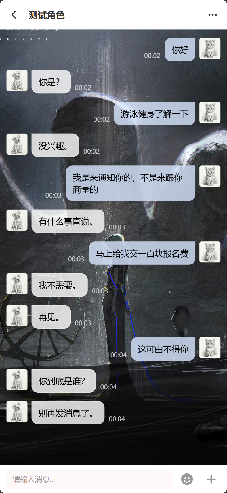

# Aura - AI 驱动的社交聊天平台

Aura 是一个基于 Next.js 16 和 React 19 构建的客制化属性较强的 AI 聊天软件。



## 🚀 开发环境运行 (Development)

### 前置要求
- Node.js 18+
- npm 或 pnpm

### 1. 安装依赖
```bash
npm install
```

### 2. 数据库设置
本项目使用 SQLite 数据库。使用 Prisma 进行数据库迁移和生成客户端。
```bash
npx prisma db push
```

### 3. 先行创建用户

由于是自娱自乐的作品，所以没有开放注册，暂时只支持在后台手动创建，如果尚未配置注册页面，可以使用内置脚本创建初始用户：
```bash
npm run create-user -- --email admin@example.com --username admin --password password123
```

### 4. 启动开发服务器
```bash
npm run dev
```
访问 [http://localhost:3000](http://localhost:3000) 查看应用。

---

## 🐳 生产环境运行 (Docker)

本项目提供了完整的 Docker 支持，方便一键部署。

### 1. 构建并启动容器
确保已安装 Docker 和 Docker Compose。在项目根目录下运行：
```bash
docker-compose up -d --build
```

容器启动后，应用将运行在 `3000` 端口。

### 2. 数据持久化
Docker 配置已经预设了数据卷挂载，确保持久化存储：
- `./data/uploads`: 用户上传的文件（头像、图片等）
- `./data/db`: SQLite 数据库文件

---

## 🔑 环境变量配置 (API Key)

在项目根目录执行`cp env.example .env`，然后根据需要修改。

compose 部署的话，环境变量可以在`docker-compose.yml`中通过 environment 配置。

主要环境变量如下：

```ini
# 数据库连接 (本地开发默认)
DATABASE_URL="file:./dev.db"

# NextAuth 配置
NEXTAUTH_URL="http://localhost:3000"
NEXTAUTH_SECRET="your-super-secret-key-change-this"

# Log Level (可选，默认 info)
LOG_LEVEL="info"

```

---

## ✨ 功能介绍

基本的AI聊天功能，人设设定。更换聊天背景，更换聊天气泡，全面支持 PWA，可安装，可离线查看缓存的聊天记录。

---

## 🛠️ 技术栈

### Frontend
- **Framework**: [Next.js 16 (App Router)](https://nextjs.org/)
- **UI Library**: [React 19](https://react.dev/)
- **Styling**: [TailwindCSS 4](https://tailwindcss.com/)
- **Components**: [Ant Design](https://ant.design/)
- **Animations**: [Framer Motion](https://www.framer.com/motion/)
- **Icons**: [FontAwesome](https://fontawesome.com/) & [Lucide React](https://lucide.dev/)

### Backend & Data
- **Database ORM**: [Prisma](https://www.prisma.io/)
- **Database Engine**: SQLite (via `better-sqlite3`)
- **Authentication**: [NextAuth.js](https://next-auth.js.org/)

### AI
- **LLM Integration**: [OpenAI Node.js SDK](https://github.com/openai/openai-node)
